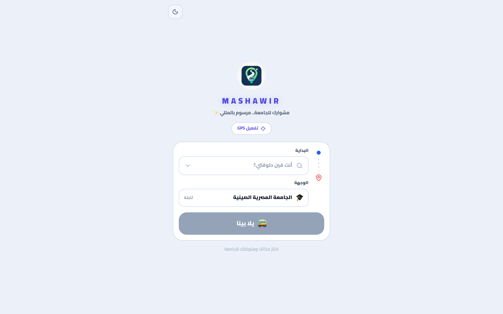
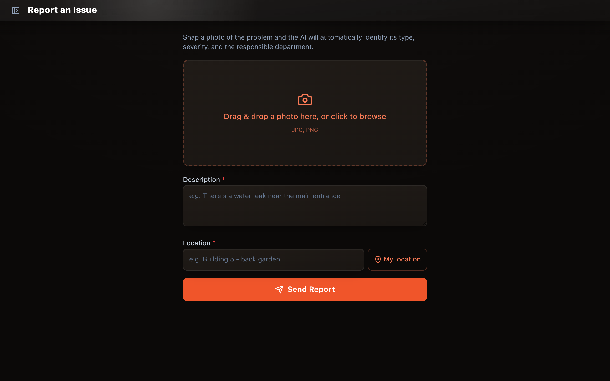

# Hi, I'm Menna 👋

**Computer Science Student @ Egyptian Chinese University (ECU)**
Founder @ Mashawir
Interested in AI and building real products, not just prototypes.

---

### 🚀 What I'm building

#### Mashawir — Founder
A transportation-tech product for navigating Egypt's informal public transportation system. Built route discovery and a transportation data system — routes, nodes, edges, stops, coordinates, and route variants — with an Arabic-first UX.
`Supabase` `SQL` `APIs` `Mapping`

#### [RealityX / urbaneye-ai](https://github.com/menna-1233/urbaneye-ai) · [live demo](https://urbaneye-ai-gamma.vercel.app)
AI-powered incident management app. Residents report community issues with a single photo; AI automatically classifies the type, severity, location, and responsible department. App + AI analysis + backend API + admin dashboard. Built for a Smart City hackathon.
`React` `TypeScript` `FastAPI` `Supabase` `Groq AI` `Leaflet`

#### [Gorgeous & Fade](https://gf-eight-opal.vercel.app)
An e-commerce web experience that translates an existing fashion brand identity into a full storefront — visual system, customer journey, catalog, cart, auth, wishlist, and reviews — built with AI-assisted prototyping.
`React` `TypeScript` `Supabase`

---

### 🛠️ Skills

  
  
  
  
  
  
  
  
  
  
  
  
  

- **REST APIs** · **AI APIs / AI-assisted development** · **UX/UI & Product Design**

---

Thanks for stopping by ✨

